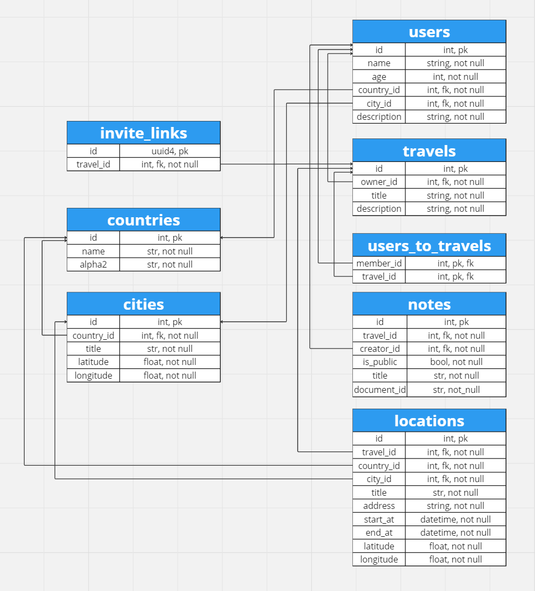
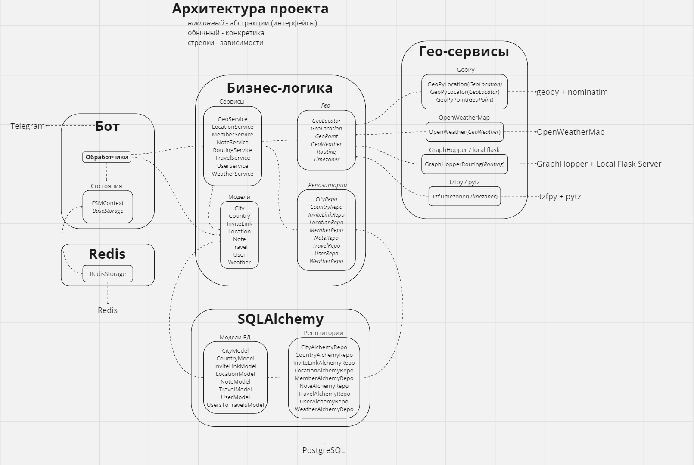

# Бот Тур-Агент
### https://t.me/travel_k1rl3s_bot
Сценарий работы, схему бд и архитектуру проекта можно посмотреть на [миро](https://miro.com/app/board/uXjVNgYibx8=/?share_link_id=821650337907)

## Запуск
1. Склонируйте репозиторий и перейдите в него
   ```bash
   git clone https://github.com/Central-University-IT-prod/backend-K1rL3s.git
   cd ./backend-K1rL3s
   ```

2. Запустите бота через docker compose \
   (должен быть установлен [движок](https://docs.docker.com/engine/install/))
   ```bash
   docker compose up -d
   ```

### docker-compose.yml
Для работы проекта я выделил 5 контейнеров (сервисов):

1. **СУБД PostgreSQL (database)**

   Постгресу было отдано предпочтение вместо sqlite'а, так как с ним удобнее взаимодействовать в ручном режиме, когда идёт разработка.

2. **СУБД Redis (redis)**

   Редис был добавлен для сохранения данных состояния пользователей в независимом от бота места.

3. **Фласк сервер (route)**

   Создание изображения с маршрутом использует `Pillow` и `requests`, синхронная работа которого будет намертво тормозить асинхронного бота. \
   Поэтому было принято решение о вынесении создания изображения в отдельный контейнер (процесс).

4. **Миграции (migrations)**

   Контейнер запускается, прогоняет миграции и выключается. Это немного, но это честная работа.

5. **Бот (bot)**

   Сам бот, в котором и происходит общение с телегой и управление всем-всем.

## Демонстрация работы

1. Откройте [бота](https://t.me/travel_k1rl3s_bot) и отправьте `/start`

2. Пройдите регистрацию ([00:00 - 00:30](https://youtu.be/94wTpm_dDCE&t=0s))

3. По желанию отредактируйте профиль ([00:30 - 01:15](https://youtu.be/94wTpm_dDCE&t=30s))

4. Создайте своё первое путешествие ([01:15 - 01:30](https://youtu.be/94wTpm_dDCE&t=1m15s))

5. По желанию отредактируйте его ([01:30 - 01:56](https://youtu.be/94wTpm_dDCE&t=1m30s))

6. Добавьте локации в путешествии ([01:56 - 03:12](https://youtu.be/94wTpm_dDCE&t=1m56s))

7. Посмотрите прогноз погоды в локациях ([7:45 - 8:06](https://youtu.be/94wTpm_dDCE&t=7m45s))

8. Посмотрите маршрут путешествия ([03:12 - 03:23](https://youtu.be/94wTpm_dDCE&t=3m12s)) \
   (Старт с города создателя убран после записи видео :( )

9. Добавьте, отредактируйте и удалите заметки  ([03:23-4:25](https://youtu.be/94wTpm_dDCE&t=3m23s))

10. Пригласите своего друга, пусть он посмотрит всё ([4:25 - 6:30](https://youtu.be/94wTpm_dDCE&t=4m25s))

11. Пригласите кого-то из рекомендованных ([6:30 - 7:45](https://youtu.be/94wTpm_dDCE&t=6m30s))


## Реализованные пункты

### Обязательные возможности

- #### Добавление данных пользователя

   Бот при первом запуске запрашивает у пользователя имя, возраст, город и страну. После юзер может сменить любые указанные данные. \
   Без прохождения регистрации человек не может получить доступ к остальному функционалу бота.

- #### Управлением путешествием

   Юзер может создать, посмотреть, отредактировать и удалить путешествие и локации в своих путешествиях.

- #### Заметки к путешествию

   Юзер в любом путешествии, к которому он имеет доступ, может создать приватные (доступные только ему) и публичные (доступные всем в путешествии) заметки. \
   Бот поддерживает текст, фото, видео, документы, голосовые и кружочки.

- #### Путешествия с друзьями

   Владелец путешествия может создать пригласительную ссылку в своё приключение. \
   Пользователь, перешедший по ней, присоединяется к путешествию и может просматривать локации, публичные заметки и других участников.

- #### Прокладывание маршрута путешествия

   При создании и редактировании локаций сохраняются их координаты, которые после используются для прокладывания маршрута и создания изображения с ним. \
   Изображение делается долго :(


### Опциональные возможности

- #### Прогноз погоды в промежуточных точках

   В каждой локации есть кнопка "Погода", по ней бот отправляет текущую погоду и прогноз через 5 дней.

- #### Поиск пользователей для совместного путешествия

   Владелец путешествия может нажать на кнопку "Поиск путешественников", по которой бот найдёт юзеров,
   возраст которых отличается не более чем на 5 лет, и они живут в одном из городов путешествия или в одном городе с владельцем. \
   Бот сделает пригласительную ссылку, которую владелец должен будет отправить юзеру. Так они смогут познакомиться лучше в личных сообщениях :)

- #### Пагинация

    Путешествия, локации, заметки, друзья и рекомендации выводятся страницами по 6 штук на странице. \
    Если чего-то больше шести, то появляются стрелочки для перехода по страницами

## Внешние интеграции, обоснование выбора

### [PostgreSQL](https://ru.wikipedia.org/wiki/PostgreSQL)

**Постгрес** - это объектно-реляционная система управления базами данных с открытым исходным кодом. \
Он используется для хранения информации о пользователях, путешествиях, локациях, заметках и других данных, необходимых для работы бота.

**Почему именно он?**
- Открытый исходный код
- Высокая производительность
- Расширяемость и гибкость
- Надежность и отказоустойчивость
- Активное сообщество и поддержка

### [Redis](https://ru.wikipedia.org/wiki/Redis)

**Редис** - это резидентная система управления базами данных класса NoSQL с открытым исходным кодом. \
Он используется для хранения данных состояний пользователей бота (например, последовательного ввода в диалогах).

**Почему он?**
- Открытый исходный код
- Молниеносная скорость (всё хранится в оперативной памяти)
- Простота использования
- Масштабируемость

### [GeoPy](https://pypi.org/project/geopy/) / [Nominatim](https://nominatim.org/)

**GeoPy** — это библиотека для Python, которая предоставляет удобный интерфейс для работы с гео-данными,
включая сервис геокодирования **Nominatim** с открытым исходным кодом, использующий данные **OpenStreetMap**. \
Они помогают определять координаты городов и локаций, а также проверяют существование городов и стран, указываемые пользователями.

**Почему они?**
- Открытый исходный код
- Простота использования
- Достаточный функционал

**Описание API**

[Поиск локации по названию](https://nominatim.org/release-docs/develop/api/Search/)
```
https://nominatim.openstreetmap.org/search?q={query}
```
query - название места в свободном формате

### [OpenWeatherMap](https://openweathermap.org/)

**OpenWeather** - сервис, предоставляющий HTTP API для получения погоды. В бесплатной версии даёт доступ к текущей погоде и прогнозу на 5 суток. \
В боте отображается для каждой локации в путешествии можно посмотреть погоду на данный момент и прогноз через 5 дней.

**Почему он?**
- Понятная документация и простота использования
- Наличие бесплатного доступа

**Описание API**

[Получения текущей погоды по координатам.](https://openweathermap.org/current)
```
https://api.openweathermap.org/data/2.5/weather?lat={lat}&lon={lon}&units={units}&lang={lang}&appid={API_KEY}
```

[Получения прогноза погоды на 5 суток по координатам.](https://openweathermap.org/forecast5)
```
https://api.openweathermap.org/data/2.5/forecast?lat={lat}&lon={lon}&units={units}&lang={lang}&appid={API_KEY}
```

lat - широта, lon - долгота, appid - ключ апи, units - единицы измерения, lang - язык короткого описания погоды


### [GraphHopper](https://www.graphhopper.com/) / [staticmap](https://github.com/komoot/staticmap) / [Tiles OSM](https://wiki.openstreetmap.org/wiki/Tiles)

**GraphHopper** - сервис, предоставляющий HTTP API для построения маршуртов. С его помощью фласк-сервер получает координаты промежуточных точек. \
staticmap - библотека для Python, которая с помощью Tiles OSM создаёт изображение с указанными клиентом линиями. Библиотека используется фласк-сервом и готовое изображение отдаётся боту.

**Почему они?**
- Открытый исходный код (слава OSM!)
- Скорость работы (построение маршурта за пару секунд)
- Простота использования

**Описание API**

[Построение маршрута, проходящий через переданные точки](https://docs.graphhopper.com/#operation/postRoute)
```
curl -X POST -H "Content-Type: application/json" "https://graphhopper.com/api/1/route?key={API_KEY}" -d '{"elevation":false,"points":[[-0.087891,51.534377],[-0.090637,51.467697]],"profile":"car"}'
```

### [tzfpy](https://github.com/ringsaturn/tzfpy) / [pytz](https://pythonhosted.org/pytz/)

**tzfpy** и **pytz** - библиотеки для Python, упрощающие работу с таймзонами.

**Почему они?**
- Открытый исходный код
- Простота использования
- Скорость работы (tzfpy написан на Rust'е)


## Схема данных СУБД

**PostgreSQL**




## Чистота кода

В проекте используются ruff, black и isort - линтеры, приводящие код к одному стилю. \
Также установлен pre-commit, чтобы не забыть использовать всё перед отправкой на гитхаб.

### Попытка в архитектуру

В проекте бизнес-логика приложения отделена от бота, базы данных и гео-сервисов.

Для инверсии зависимостей используются абстрактные классы ([тык](./src/core/geo), [тык](./src/core/repositories)), определяющие интерфейс. \
Для гео-сервисов написаны классы-адаптеры ([тык](./src/geo)).

Взаимодействие с базой данных реализует интерфейс репозиториев ([тык](./src/database/repositories)).

Обо всех классах с конкретной реализацией известно только в DI мидлваре ([тык](./src/bot/middlewares/outer/core_di.py)),
поэтому сервисы и хэндлеры ничего о них не знают и зависят только от интерфейсов.

- core - независимый, центральный слой
- bot - слой бота
- database - слой базы данных
- geo - слой реализации гео-сервисов

**Примерная визуализация архитектуры**

